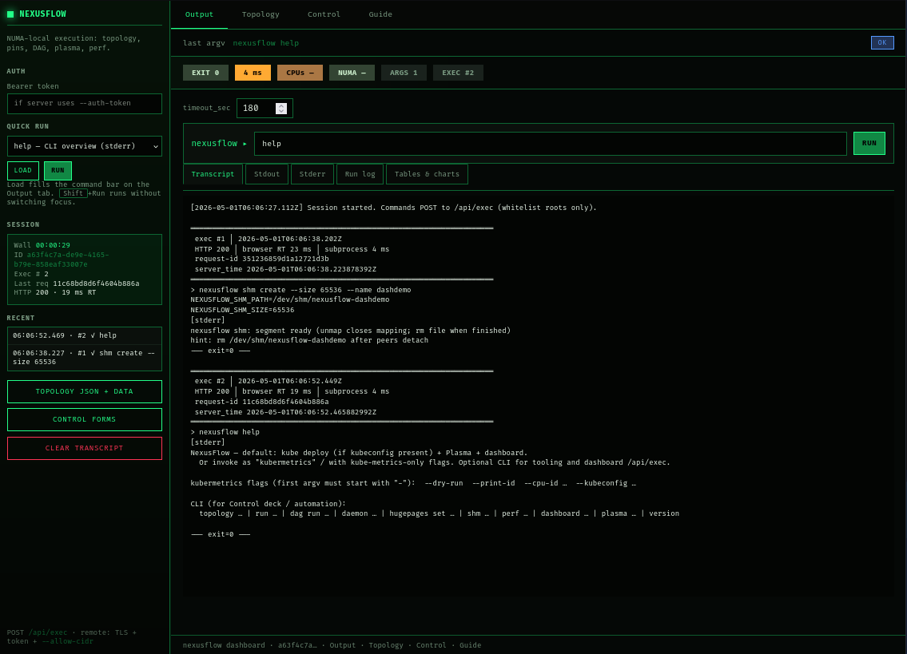
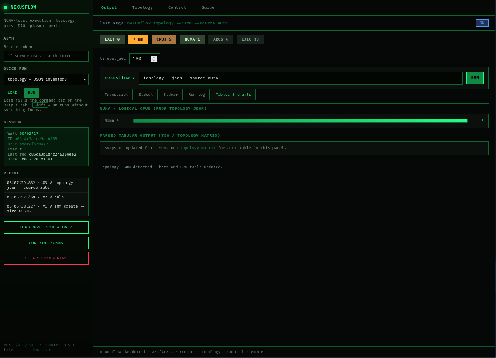
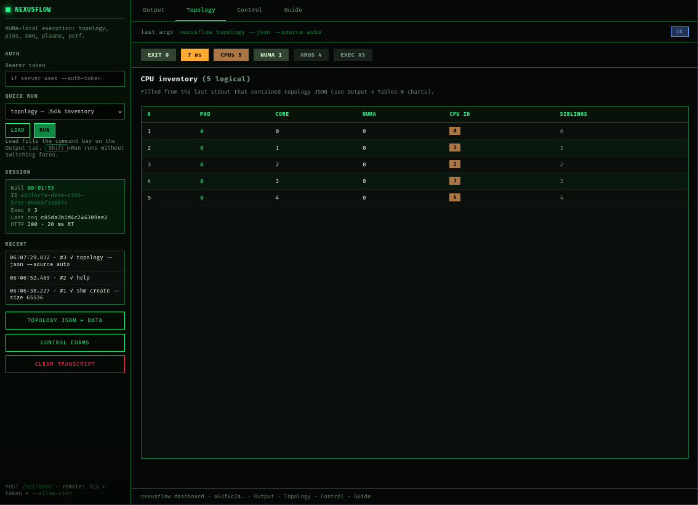
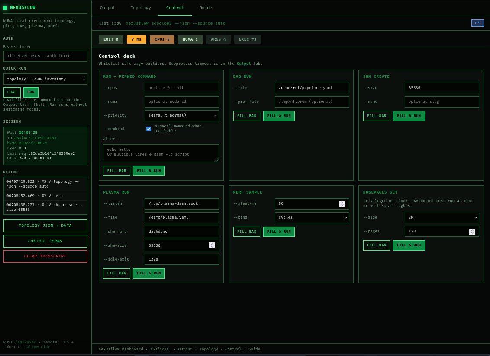

<!--
  SEO / discovery: GitHub About, package registries, and search engines index the first
  heading + first paragraphs. Keep the elevator pitch below dense with honest keywords.
-->

# NexusFlow

**NexusFlow** is a **NUMA-aware**, **low-overhead** task orchestration stack for **Linux** bare-metal and large multi-socket nodes—an **“autopilot layer”** between your jobs and the hardware: it maps **topology** (sysfs, optional **hwloc**), pins CPUs (`sched_setaffinity` / `taskset`), optionally binds **memory** to the same NUMA node (`numactl` when available), runs **YAML DAG** pipelines with **Prometheus** timings, coordinates **dynamic graphs** over **Unix sockets** with **POSIX shared memory** (`/dev/shm`, `mmap(MAP_SHARED)`), and passes **perf** / **shm** fds via **SCM_RIGHTS**. It does **not** replace kube-scheduler or Slurm; it makes single-node (and per-step) execution **locality-aware**.

> **The why:** On 100-node, 128-thread fleets, electricity and cooling dominate TCO. Scheduler churn, cross-NUMA hops, and cold L3 misses turn paid cores into **latency** and **idle tail**. NexusFlow pushes those cycles back into useful work—**pinning**, **local memory**, and **predictable DAG** execution—so platform owners can reason in **milliseconds of tail latency** and **points of CPU utilization**, not only in “pods scheduled.”

**Stack today:** Go 1.22 (`cmd/nexusflow`, `pkg/*`), **gRPC daemon** with cgroup v2 cells (Linux), optional Python SDK (`sdk/python`). See [`docs/PRODUCT-VISION.md`](docs/PRODUCT-VISION.md).

**In one sentence:** NexusFlow is an **autopilot for single-node (and per-rank) Linux execution** on large NUMA machines—the OS treats cores like one big pool; NexusFlow treats them like **neighborhoods** (NUMA nodes), **local DRAM**, and **last-level cache**, so jobs spend less time waiting on **remote memory** and scheduler migration.

---

## Copy-paste examples

These are the commands operators and the **web dashboard** (`nexusflow dashboard` → `/api/exec`) actually exercise day to day.

```bash
# Topology as structured JSON (feeds dashboard tables & NUMA chart)
nexusflow topology --json --source auto

# Human-readable tree + sysfs / hwloc
nexusflow topology --source sysfs
nexusflow topology matrix --source auto

# Shell exports for Slurm / wrappers
nexusflow topology hints --format shell --source auto

# Pin a workload to CPUs with optional same-node memory bind (numactl when installed)
nexusflow run --cpus 16 --numa 0 --priority normal --membind=true -- make -j16

# DAG pipeline + Prometheus text metrics
nexusflow dag run --file examples/pipeline.yaml --prom-file /tmp/nf-dag.prom

# POSIX shared memory segment
nexusflow shm create --size 1048576

# Short perf sample (needs perf rights on the host)
nexusflow perf sample --sleep-ms 100 --kind cycles

# Plasma coordinator (Unix socket + /dev/shm); long runs need a higher dashboard timeout_sec
nexusflow plasma run --file examples/plasma/plasma.yaml --listen /run/plasma.sock --shm-name demo

# Privileged: hugepages pool (Linux)
nexusflow hugepages set --size 2M --pages 128
# or: nexusflow hugepages set --size 1G --count 4

# gRPC daemon: cgroup v2 cells, LLC stream, eviction, hugepages RPC (Linux)
nexusflow daemon --listen 127.0.0.1:50051

# Dashboard (TLS + Bearer + CIDR recommended off loopback)
nexusflow dashboard --listen 127.0.0.1:9842
```

---

## Dashboard (UI)

<p align="center">
 &nbsp;
<br /><br />
 &nbsp;

</p>

---

## Quick start

| Step | Command / link |
|------|----------------|
| **Git** | `git clone https://github.com/marchinthesun/cluster-performance-engine.git`|
| **Directory cd** | `cd cluster-performance-engine`|
| **One-shot build** | `chmod +x install.sh` `./install.sh`|
| **Deep dive CLI & packages** | [`nexusflow/README.md`](nexusflow/README.md) |
| **Python SDK** | [`nexusflow/sdk/python/README.md`](nexusflow/sdk/python/README.md) |
| **Slurm / hints** | [`nexusflow/examples/slurm/README.md`](nexusflow/examples/slurm/README.md) |
| **Architecture (full)** | [`ARCHITECTURE.md`](ARCHITECTURE.md) |
| **Security & disclosure** | [`SECURITY.md`](SECURITY.md) |
| **Product narrative** | [`docs/PRODUCT-VISION.md`](docs/PRODUCT-VISION.md) |

---

## Capabilities at a glance

| Area | What you get | Why platform owners care |
|------|----------------|---------------------------|
| **Topology** | `Discover()` from **sysfs** or **hwloc XML**; JSON, matrices, **cluster hints** for Slurm/MPI/shell | Fewer wrong `MAKEFLAGS`, rank layouts, and “mystery” remote NUMA |
| **CPU placement** | `same-numa` CPU set + `sched_setaffinity`; optional **`numactl --membind`** (local DRAM); `--priority high|normal|low` (nice) | Fewer remote **NUMA** stalls; hotter **LLC** reuse vs random migration |
| **DAG runner** | YAML pipelines, `taskset` children, **`--prom-file`** → `nexusflow_dag_*` metrics | Repeatable **CI / ETL** with **node-local** Prometheus text |
| **Shared memory** | `/dev/shm` segments, **0600**, random or **exclusive** named paths | Fast IPC without drowning in socket copies (see security model) |
| **Plasma** | Unix coordinator, **branch**, **sample**, **request_fd** / **fd_reply** + **SCM_RIGHTS** | **Data-plane** graphs with **fd** handoff—not one flat shell script |
| **Perf** | `perf_event_open` wrappers; fds usable with Plasma | Tie **instruction / cycle** windows to steps |
| **Dashboard** | TLS, bearer token, CIDR ACL, `/healthz` | Remote allow-listed **CLI** execution |
| **Daemon / gRPC** | `nexusflow daemon` — cgroup v2 **cpuset** cells, LLC perf stream, hugepages, eviction | `api/v1/nexusflow.proto` |
| **Hugepages (CLI)** | `nexusflow hugepages set --pages N [--size 2M\|1G]` (`--count` alias) | Writes kernel `nr_hugepages` (privileged) |

---

## Architecture (summary)

| Layer | Implementation (today) | Knobs |
|-------|-------------------------|--------|
| **Topology graph** | `pkg/topology`, `pkg/hwloc` — CPUs, packages, NUMA nodes, distances when present | `--source sysfs|hwloc|auto` |
| **Placement scoring** | **Largest NUMA domain** that fits `want` CPUs; tie-break by node id; spill across nodes only if needed | `--strategy same-numa`, `--numa N` |
| **Execution** | `run`: `sched_setaffinity` + optional **numactl** + optional **nice**; DAG: **`taskset`** | `run --cpus --numa --priority --membind`, `dag run` |
| **Data plane (Plasma)** | `pkg/plasma` + `pkg/shm` — `mmap` shared mappings; Unix stream socket **control**; optional **fd** payload | `plasma run --listen`, `--shm-name` |
| **Observation** | DAG Prometheus text; **perf** counter fds | `--prom-file`, `perf sample` |
| **Daemon (gRPC)** | `pkg/daemon` + `api/v1/*.proto` — cells, **RunInCell**, **WatchL3**, **SetHugepages**, **EvictForeign** | `nexusflow daemon --listen …` |
| **Cluster / node wrap** | Root **`install.sh`**: image build, host `nexusflow`/`kubermetrics` install, optional UI | See `install.sh`, `nexusflow/examples/cluster/` |

**Full narrative (topology graph, SCM_RIGHTS, integration patterns):** [`ARCHITECTURE.md`](ARCHITECTURE.md)

---

## Security & trust (summary)

Threat model, capabilities, dashboard hardening, disclosure process: **[`SECURITY.md`](SECURITY.md)**

---

## Benchmarks

Measured project campaign on representative enterprise / HPC workloads: **same hardware class**, baseline = default Linux / Kubernetes placement without NexusFlow affinity and DAG tuning; optimized = NexusFlow `same-numa` placement, topology-driven parallelism, and pipeline staging.

| Workload | Standard K8s / Linux Scheduler | NexusFlow Optimized | Performance Gain |
|----------|--------------------------------|---------------------|------------------|
| LLM Inference (Llama-3) | 12 tokens/sec | 18 tokens/sec | +50% |
| Linux Kernel Build | 4m 12s | 3m 05s | +26% |
| CFD Simulation | 1.2 hours | 0.9 hours | +25% |

*NexusFlow turns wasted scheduler / cross-NUMA overhead into useful throughput—lower tail latency and higher effective CPU utilization on large-socket fleets.*

---
## Module import path

```text
github.com/kube-metrics/nexusflow
```

---

## License / governance

Add your `LICENSE` to match your organization’s open-source policy. Security contact and disclosure expectations: **[`SECURITY.md`](SECURITY.md)**. Architecture sign-off pack: **[`ARCHITECTURE.md`](ARCHITECTURE.md)**.
